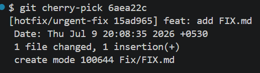

## Shreyansh Thakur, Batch - 1, 9th July 2026

# This is a git assignment repository created to test my git skills.

## Task 1 : What happens if you forget .gitignore on your first commit?
- If we forget .gitignore on our first commit, it results in releasing of sensitive information like secrets, api keys, passwords, etc through .env file and can end up with unnecessary files and folders such as node_modules, dist, etc.
- If we forget .gitignore there are a few ways to approach this problem :-
    1. We can rewrite history and add .gitignore in our first commit by using commands such as git commit --amend or git rebase -i HEAD~. But it is very important to note that one should never rewrite history once the code is pushed to the remote, since there may be developers who may have their work on this specific commit and rewriting history creates a new commit altogether with a different SHA-1 checksum.
    2. We can also reset to the previous commit by running the command git reset --mixed commit-hash and then stage the .gitignore file and commit the changes back, but again whenever we rewrite history it's important to note that the work has either not been pushed to the remote or no one else is working on the commit which is being rewritten.
    
## Task 4 : What does git log --oneline --graph results in?

- It displays a linear history of graph where there are multiple commits because there have been no deviations as of now.

## Task 4 : What does git diff HEAD~2..HEAD results in?

- It displays all the changes which have been made in past two commits.

## Task 6 : Is git merge feature/add-navigation a fast forward merge?

- No it is not a fast forward merge, because fast forward merge only occurs when the HEAD of the main branch can directly move to the target branch without creating any commits. But in this case when we merge feature/add-navigation branch to main, it creates a merge commit because our main branch can not directly move forward to the feature/add-navigation branch.

## Task 7 : Resolution of merge conflict arised from git merge feature/add-footer.

- I have resolved the merge conflict by accepting the incoming changes which means the changes which were made in the feature/add-footer branch becuase it has a more detailed and complete structure of the footer as compared to the generic structure of the footer in the main branch.

## Task 7 : git log --graph screenshot after merging feature/add-footer

## Task 8 : git log --graph before and after rebase, fast forward merge after rebase
- Before rebase

- After rebase

- Fast forward merge after rebase

## Task 8 : When should you rebase vs merge?
- git rebase is used to maintain clean and linear history but in doing so it rewrites commit history.
- Whereas git merge merges the two branches into creating a new merge commit without rewriting the commit history or preserving it.
- You can use rebase if you are working on a branch locally or have no one contributing to your feature branch, since rebase rewrites history. Whereas if you are working on a remote branch and you have other developers tagging along with you, you should always use git merge since it maintains commit history.

## Task 8 : Golden rule of rebasing.
- Never rebase branch which is pushed to the remote server or has developers contributing to them.

## Task 9 : Why cherry-pick instead of merging the whole branch?
- cherry-pick selectively picks a specific commit out of a branch and applies it on the desired branch.
- Whereas merge merges two branches completely which means all the unnecessary files also gets merged due to merge.

## Task 9 : When is cherry-pick appropriate?
- Cherry pick is very useful when we want to provide a hotfix patch to a specific bug in production or when we want to extract a specific feature from a stale branch instead of merging it completely.

## Task 9 : Screenshots of cherry-pick and pull request

- git cherry-pick     

- Pull request

## Task 10 : Screenshots of bad commit and reverting it back

- git log after bad commit

- git log after revert

## Task 10 : When to use git revert?    
- git revert does the exact opposite of what a commit does in order to go back, without wiping history.          
- git revert creates a new commit to go back, which means it keeps the branch's history intact so it is really helpful when working on remote or in a team of multiple developers leading to fewer conflicts.

## Task 10 : Screenshots of reset --hard and recovery using reflog
- git reset --hard
    

- git reflog
     

- recovery using git reflog
    

- fast forward merge from recovery branch

## Task 10 : When to you use git reset --hard
- git reset --hard wipes out the history of one or a list of commits to undo the changes.
- One must be very careful whilst using git reset --hard as it rewrites the history, so undoing a git reset --hard is not an option.

## Task 10 : Never reset --hard on a remote repository or a repository on which other developers are working, because git reset --hard rewrites history and if some other developer is reliant on that specific commit it will lead to a ton of conflicts.

## Task 11 : Screenshots of git stash
- git stash list before stashing
    
- git stash push     
      
- git stash list after stashing      
 
- git stash apply     

## Task 12 : Screenshots of git rebase -i HEAD~5
- Logs before git rebase -i HEAD~5         
    
- git rebase -i HEAD~5 editor before editing    
     
- git rebase -i editor after editing (sligt change, the first commit is pick I edited it later and forgot to take the screenshot.)     
      
- git log after rebase -i HEAD~5       

## Task 13 : Screenshots of merging pull requests

- Reply to a comment from the reviewer     
     
- Merge(no fast forward)        
%20from%20the%20reviewer.png)       
- Squash merge         
         
- Commit history of squash merge and merge(no fast forward)

## Task 16 : Screenshots of git bisect
- git log before bisect         
       
- git bisect bad        
        
- git bisect good
          
- git bisect step 1         
          
- git bisect step 2
          
- git bisect result

## Task 17 : git hook
#!/bin/bash

#Search staged changes for TODO or FIXME (case-insensitive)

if git diff --cached | grep -Ei '(TODO|FIXME)'; then
    echo "❌ COMMIT REJECTED: Your staged changes contain 'TODO' or 'FIXME'."
    echo "Please resolve these placeholders before committing."
    exit 1
fi

exit 0

## Task 17 : Screenshots of git hook
- Problematic code    
     
- git hook error message
        
- Corrected code        
        
- git hook allows correct code         

## Task 18 : git blame

## Task 18 : How would git blame help in a team project?
- git blame is a debugging command which is used to identify what changes were made in which commit and who made those changes.
- git blame is extremely useful when working in a team to identify who introduced a buggy commit and can ask them about why did they make certain changes and ask them for doing tasks responsibly next time.
- git blame also helps identify a particular section of code in a file was introduced in which commit and was edited or created by whom? It is very useful to identify who introduced buggy code. You can see a particular section with the help of -L flag like git blame -L 25,50 README.md to see who created or made changes to line 25 to 50 in README.md file.