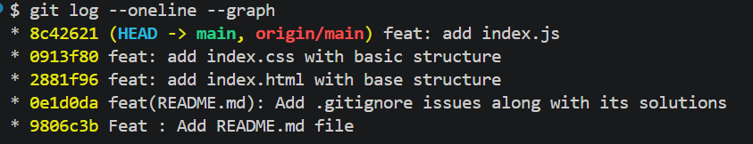
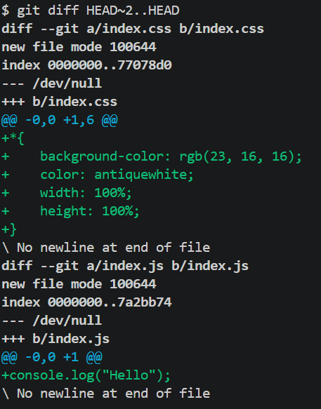

## Shreyansh Thakur, Batch - 1, 9th July 2026

# This is a git assignment repository created to test my git skills.

## What happens if you forget .gitignore on your first commit?
- If we forget .gitignore on our first commit, it results in releasing of sensitive information like secrets, api keys, passwords, etc through .env file and can end up with unnecessary files and folders such as node_modules, dist, etc.
- If we forget .gitignore there are a few ways to approach this problem :-
    1. We can rewrite history and add .gitignore in our first commit by using commands such as git commit --amend or git rebase -i HEAD~. But it is very important to note that one should never rewrite history once the code is pushed to the remote, since there may be developers who may have their work on this specific commit and rewriting history creates a new commit altogether with a different SHA-1 checksum.
    2. We can also reset to the previous commit by running the command git reset --mixed commit-hash and then stage the .gitignore file and commit the changes back, but again whenever we rewrite history it's important to note that the work has either not been pushed to the remote or no one else is working on the commit which is being rewritten.
    
## What does git log --oneline --graph results in?

- It displays a linear history of graph where there are multiple commits because there have been no deviations as of now.

## What does git diff HEAD~2..HEAD results in?

- It displays all the changes which have been made in past two commits.